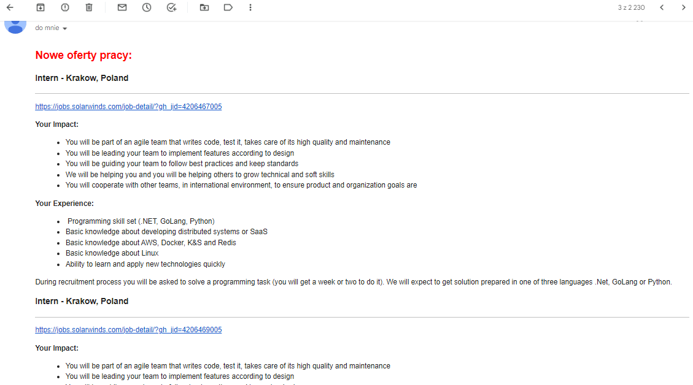

# solarwinds-job-checker
### A simple script checking if there are new job offers at SolarWinds.

To run this script every 24 hours, you can use the cron utility on Linux or macOS, or the Task Scheduler on Windows.

#### Here are the steps to run a Python script every 24 hours using cron on Linux or macOS:

1. Open your terminal and type "crontab -e" to open the crontab editor.
2. Add the following line at the bottom of the file:
```
0 0 * * * /usr/bin/python3 /path/to/your/script.py
```
3. Replace /path/to/python with the path to your Python interpreter and /path/to/script.py with the path to your Python script.
4. Save and close the file.

### DEMO

